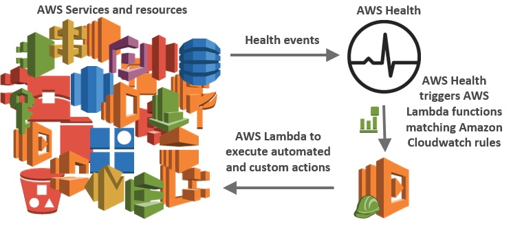

## AWS Health Tools

### Description
The samples provided in AWS Health Tools can help you build automation and customized alerts in response to AWS Health events.

AWS Health provides ongoing visibility into the state of your AWS resources, services, and accounts. The service gives you awareness and remediation guidance for resource performance or availability issues that may affect your applications that run on AWS. AWS Health provides relevant and timely information to help you manage events in progress, as well as be aware of and prepare for planned activities. The service delivers alerts and notifications triggered by changes in the health of AWS resources, so you get near-instant event visibility and guidance to help accelerate troubleshooting.

More information about AWS Health and Personal Health Dashboard (PHD) is available here: http://docs.aws.amazon.com/health/latest/ug/what-is-aws-health.html

> NOTE: To get notifications about public events (global events that are not tied to your account), you must have a Business or Enterprise support plan from AWS Support. If you call the AWS Health API from an AWS account that doesn't have a Business or Enterprise support plan, you receive a SubscriptionRequiredException error.

Setup and usage instructions are present for each tool in its respective directory:  

#### Solutions:
[AWS Health Aware (AHA) - automated notification solution for sending well-formatted AWS Health Alerts across accounts and regions](https://github.com/aws-samples/aws-health-aware/)  

#### Custom Notifications:
[AWS Health event SMS notifier](sms-notifier/)  
[AWS Health event Chime notifier](chime-notifier/)  
[AWS Health event Amazon Simple Notification Service (SNS) Topic Publisher](sns-topic-publisher/)  
[AWS Health event Slack notifier](slack-notifier/)  
[AWS Health event Direct Connect maintenance notifier](dx-maintenance-notifier/)  
[AWS Health event Coralogix notifier](coralogix-notifier/)  
[AWS Health Abuse event DOS report notifier](dos-report-notifier/)  
[AWS Health SHD event Chime/Slack/SNS notifier](shd-notifier/)  
[AWS Health Organizational View Alerts](https://github.com/aws-samples/aws-health-organizational-view-alerts)  
#### Automated Actions:
[AWS Codepipeline disable stage transition triggered when AWS Health issue event generated](automated-actions/AWS_Codepipeline_Disable_Stage_Transition/)  
[AWS Health AWS_EC2_INSTANCE_STORE_DRIVE_PERFORMANCE_DEGRADED triggers automated EC2 Instance stop or terminate](automated-actions/AWS_EC2_INSTANCE_STORE_DRIVE_PERFORMANCE_DEGRADED/)  
[AWS Health AWS_ELASTICLOADBALANCING_ENI_LIMIT_REACHED triggers freeing up of unused ENIs](automated-actions/AWS_ELASTICLOADBALANCING_ENI_LIMIT_REACHED/)  
[AWS Health AWS_RISK_CREDENTIALS_EXPOSED remediation](automated-actions/AWS_RISK_CREDENTIALS_EXPOSED/)  
[AWS Health AWS_EBS_VOLUME_LOST Remediation](automated-actions/AWS_EBS_VOLUME_LOST/)  
#### Demos:
[AWS Health API high availability endpoint](high-availability-endpoint/)  

### License
AWS Health Tools are licensed under the Apache 2.0 License.

Disclaimer: The “AWS_<serviceName>_OPERATIONAL_ISSUE” Amazon CloudWatch event type codes are for events where AWS is posting details to specific AWS accountIds. General service health events are not posted to this event type code at this time. Instead they are currently posted to the Service Health Dashboard (SHD) and are visible via the Personal Health Dashboard (PHD) in the AWS management console as well as returned via the AWS Health API.
