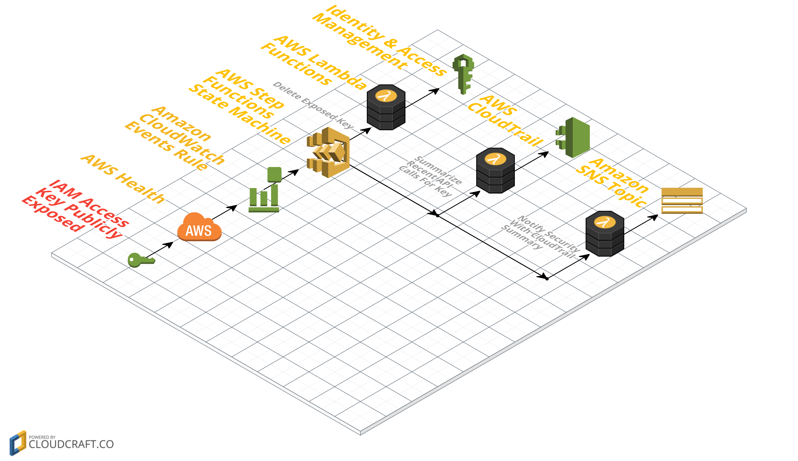

# AWS Health AWS_RISK_CREDENTIALS_EXPOSED

This example demonstrates how to use [AWS Step Functions](https://aws.amazon.com/step-functions/) to orchestrate a serverless [AWS Lambda](http://aws.amazon.com/lambda/) workflow in response to an [Amazon CloudWatch](https://aws.amazon.com/cloudwatch/) Event generated by [AWS Health](http://docs.aws.amazon.com/health/latest/ug/what-is-aws-health.html). 

AWS proactively monitors popular code repository sites for exposed AWS Identity and Access Management (IAM) access keys. On detection of an exposed IAM access key, AWS Health generates an AWS_RISK_CREDENTIALS_EXPOSED CloudWatch Event. In response to this event, an automated workflow deletes the exposed IAM Access Key, summarizes the recent API activity for the exposed key, and sends the summary message to an Amazon Simple Notification Service (SNS) Topic to notify the subscribers- all orchestrated by an AWS Step Functions state machine.

This repository contains sample code for all the Lambda functions depicted in the diagram below as well as an AWS CloudFormation template for creating the functions and related resources.



### Walkthrough of the Architecture
1. An IAM Access Key is inadvertently uploaded to one of the popular code repositories monitored by AWS.
1. AWS Health detects the key, generating a AWS_RISK_CREDENTIALS_EXPOSED CloudWatch Event. AWS also temporarily restricts the API calls the key is able to make.
1. A configured CloudWatch Events rule matches this event, triggering an execution of the `ExposedKey` state machine, which has the following sub-steps:
    * Delete the exposed IAM Access Key Pair. If there is an error in this step then skip to the last step.
    * Summarize recent API activity for the user from CloudTrail.
    * Send security notification message containing summary to `SecurityNotificationTopic` SNS Topic. If there was an error in the first step the notify security that error occurred and incident requires manual inspection and intervention.


## Running the Example
 
#### Option 1: Launch the CloudFormation Template in US East - N. Virginia (us-east-1) 
The backend infrastructure can be deployed in US East - N. Virginia (us-east-1) using the provided CloudFormation template.
Click **Launch Stack** to launch the template in the US East - N. Virginia (us-east-1) region in your account:

[](https://console.aws.amazon.com/cloudformation/home?region=us-east-1#/stacks/new?stackName=AWSHealthCredsExposed&templateURL=https://s3.amazonaws.com/aws-health-tools-assets/cloudformation-templates/risk_credentials_exposed.output.yaml)

(In the last page of the wizard, make sure to:

1. Click the checkboxes to give AWS CloudFormation permission to **"I acknowledge that AWS CloudFormation might create IAM resources"** and **"I acknowledge that AWS CloudFormation might create IAM resources with custom names"**
1. Follow the instructions to **"Create Change Set"** 
1. Click **"Execute"**
)

#### Option 2: Launch the CloudFormation Template Manually 

If you would like to deploy the template manually, you need a S3 bucket in the target region, and then package the Lambda functions into that S3 bucket by using the `aws cloudformation package` utility.

Clone the repository

```bash
git clone https://github.com/aws/aws-health-tools.git
```

Set environment variables for later commands to use:

```bash
S3BUCKET=[REPLACE_WITH_YOUR_BUCKET]
REGION=[REPLACE_WITH_YOUR_REGION]
STACKNAME=[REPLACE_WITH_DESIRED_NAME]
```

Then go to the `cloudformation` folder and use the `aws cloudformation package` utility

```bash
cd cloudformation

aws cloudformation package --region $REGION --s3-bucket $S3BUCKET --template risk_credentials_exposed.serverless.yaml --output-template-file risk_credentials_exposed.output.yaml
```
Last, deploy the stack with the resulting yaml (`risk_credentials_exposed.output.yaml`) through the CloudFormation Console or command line:

```bash
aws cloudformation deploy --region $REGION --template-file risk_credentials_exposed.output.yaml --stack-name $STACKNAME --capabilities CAPABILITY_NAMED_IAM
```

## Testing the Example
To test the example without exposing an IAM Access Key to a public repository you can simulate the workflow by executing the `ExposedKey-XXXXXXXXXXXX` state machine with a set of test json for the event. To do this follow the steps detailed below.

Ensure you have at least one E-mail address [subscribed](http://docs.aws.amazon.com/sns/latest/dg/SubscribeTopic.html) to the `SecurityNotificationTopic` created by the template to receive the notification.

1. Go to the [Identity & Access Management](https://console.aws.amazon.com/iam/home) console
1. Go to `Users`
1. Click `Add User` and create a user with programmatic access
    * For the `User name` put `test-user`
    * For `Access type` select `Programmatic access`
    * **Do not set any permissions for the user**
    * Note the `Access key ID` from the Review page for later use in the test json
1. Go to the [Step Functions](https://console.aws.amazon.com/states/home?region=us-east-1#/) console
1. Select the `ExposedKey` state machine
1. Click `New execution` to create the test execution of the state machine
    * Copy and paste the json below to the execution json field
    * Replace `ACCESS_KEY_ID_HERE` with the `Access key ID` noted from the earlier creation of `test-user`
    * You do not need to enter an execution id as one will be randomly generated by default
```json
{
    "version": "0",
    "id": "121345678-1234-1234-1234-123456789012",
    "detail-type": "AWS Health Event",
    "source": "aws.health",
    "account": "123456789012",
    "time": "2016-06-05T06:27:57Z",
    "region": "us-east-1",
    "resources": [],
    "detail": {
        "eventArn": "arn:aws:health:us-east-1::event/AWS_RISK_CREDENTIALS_EXPOSED_XXXXXXXXXXXXXXXXX",
        "service": "RISK",
        "eventTypeCode": "AWS_RISK_CREDENTIALS_EXPOSED",
        "eventTypeCategory": "issue",
        "startTime": "Sat, 05 Jun 2016 15:10:09 GMT",
        "eventDescription": [
            {
                "language": "en_US",
                "latestDescription": "A description of the event will be provided here"
            }
        ],
        "affectedEntities": [
            {
                "entityValue": "ACCESS_KEY_ID_HERE"
            }
        ]
    }
}
```

You can follow the state machine's progress in the Step Functions console. The summary message for `test-user` will be sent to the e-mail address(es) subscribed to the `SecurityNotificationTopic` SNS Topic.

Once you have received the notification e-mail you can return to the IAM console to verify that the key created for `test-user` has been deleted.

* **Note that the summary for this user will likely be empty as it will not have logged any API calls to CloudTrail**

Here is an example of what this message might look like for a user who has made recent API calls to IAM and Step Functions:

```
At DETECTED_TIME the IAM access key ACCESS_KEY_ID for user USERNAME on account ACCOUNT_ID was deleted after it was found to have been publicly exposed on the internet.
Below are summaries of the most recent actions, resource names, and resource types associated with this user over the last 24 hours.

Actions:
        PutRolePolicy: 16
        CreateRole: 10
        DeleteRolePolicy: 10
        DeleteRole: 8
        CreateStateMachine: 2
        DeleteStateMachine: 1
        StartExecution: 1

Resource Names:
        SomeResourceName: 10
        SomeOtherResourceName: 39

Resource Types:
        AWS::IAM::Role: 64
        AWS::IAM::Policy: 26

These are summaries of only the most recent API calls made by this user. Please ensure your account remains secure by further reviewing the API calls made by this user in CloudTrail.
```

To see how the state machine catchs the failure to delete the IAM access key in the first step use the same JSON from the previous test with the now deleted IAM access key. Because the access key has already been deleted the `DeleteAccessKeyPair` state raises an error and skips to the `NotifySecurity` state due to the [catch configuration](http://docs.aws.amazon.com/step-functions/latest/dg/amazon-states-language-errors.html#amazon-states-language-fallback-states) specified in the task. The `NotifySecurity` state detects the injected error message and notifies your security team that there was an error deleting the key so manual inspection and intervention is required. Here is an example of the error message:

```
An error occured when attempting to delete an exposed IAM access key for one of your IAM users. Please login to your account and navigate to the Personal Health Dashboard for more details on this incident and how to resolve it.

Personal Health Dashboard Link: https://phd.aws.amazon.com/phd/home?region=us-east-1#/dashboard/open-issues
```


## Cleaning Up the Stack Resources

To remove all resources created by this example, do the following:

1. Delete the CloudFormation stack.
1. Delete the CloudWatch log groups associated with each Lambda function created by the CloudFormation stack.

## CloudFormation Template Resources

The following sections explain all of the resources created by the CloudFormation template provided with this example.

### CloudWatch
- **RiskCredentialsExposedRule** - A CloudWatch Events Rule to detect AWS Health AWS_RISK_CREDENTIALS_EXPOSED events and send them to the Step Functions state machine target

### Step Functions
- **ExposedKeysStepFunction** - A Step Functions state machine that orchestrates the access key deletion, API call summary, and notification of security

### Lambda
- **DeleteAccessKeyPair** - Lambda function that deletes the exposed IAM Access Key Pair associated with username provided by event.
- **LookupCloudTrailEvents** - Lambda function that looks up and summarizes recent API activity for the exposed access key provided by the event.
- **NotifySecurity** - Lambda function that constructs and sends security notification message containing API activity summary to SNS Topic created by this CloudFormation template.

### SNS
- **NotificationTopic** - SNS Topic that API activity security message is sent to.

### IAM
- **ExecuteStateMachineRole** - IAM Role with policy that allows CloudWatch Events rule to invoke executions of Step Functions state machines
- **StepFunctionExecutionRole** IAM Role with policy that allows Step Functions state machines to invoke Lambda functions.
- **LambdaDeleteAccessKeyPairRole** - IAM Role with policy that allows Lambda function to invoke "iam:DeleteAccessKey" and "iam:GetAccessKeyLastUsed" API calls and write log messages to CloudWatch Logs.
- **LambdaLookupCloudTrailEventsRole** - IAM Role with policy that allows Lambda function to invoke "cloudtrail:LookupEvents" API call and write log messages to CloudWatch Logs.
- **LambdaSnsPublishRole** - IAM Role with policy that allows Lambda function to invoke "sns:Publish" API call and write log messages to CloudWatch Logs.


## License

This reference architecture sample is licensed under Apache 2.0.
